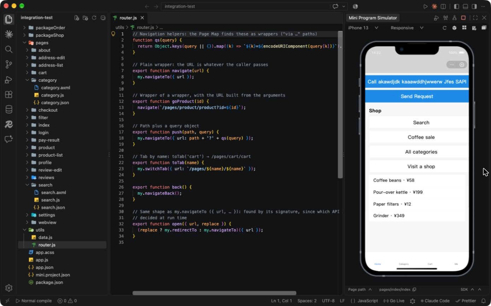
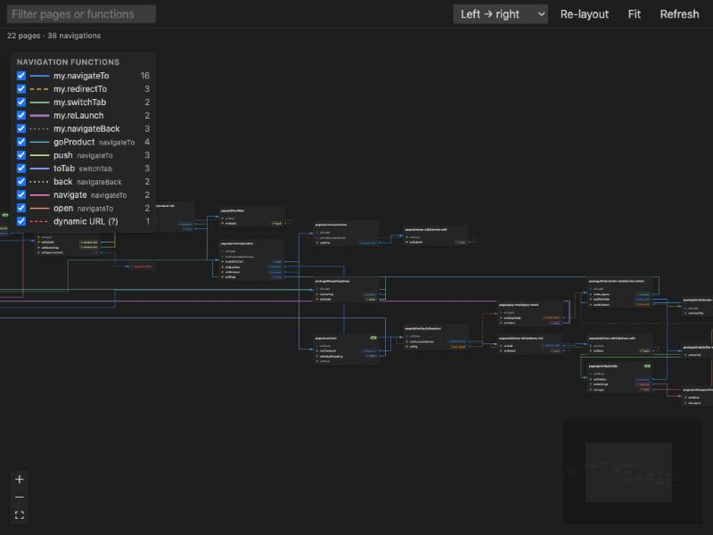
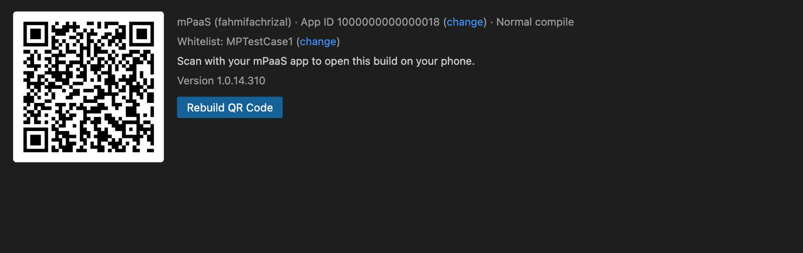

# Miniprogram Preview for VS Code

**Build miniprograms without leaving VS Code.** Run the simulator next to your code, mock native APIs, map how your pages connect and send a preview to your phone, all built on the official [`minidev`](https://www.npmjs.com/package/minidev) CLI.

[](https://github.com/fahmifachrizal/miniprogram-preview-extension/releases)


---

## Contents
- [Features](#features)
- [Installation](#installation)
- [Quick start](#quick-start)
- [Commands](#commands)
- [Settings](#settings)
- [Public and internal builds](#public-and-internal-builds)
- [Development](#development)
- [Project structure](#project-structure)
- [Troubleshooting](#troubleshooting)
- [Roadmap](#roadmap)

## Features



### 📱 Simulator in the side bar
- Opens in the right-hand (secondary) side bar, not an editor tab, so your files never open on top of it.
- Drag the side bar's edge to set the width; VS Code remembers it.
- The simulator is laid out at least 440px wide. In a narrower side bar it's drawn smaller but stays fully visible, and the phone keeps its aspect ratio.
- **Live reload:** edit a file and the app rebuilds and restarts.
- Tab bar, network emulation (Toolbox → Network) and a "Physical" zoom.
- Click the page path under the phone to open that page's source.
- With the internal build, it's your miniprogram service provider's own IDE simulator (iPhone 16 devices, appx-ng); see [builds](#public-and-internal-builds).

### 🧩 `my.*` APIs that just work
APIs that don't need a service-provider account behave as they do in the IDE:
- storage (kept while the simulator runs), the file system, download/upload, images, sockets, clipboard and location;
- dialogs and pickers, navigation and the tab bar.

Account-bound APIs (login, auth codes, payment, cloud) don't work in the simulator.

**`<web-view>`:** H5 pages load through a local proxy that gives them the JS bridge.
- `my.postMessage` / `my.onMessage`, the navigation calls, `my.getEnv`, `my.alert` and storage all work.
- Pages that forbid framing still show.

### 🎭 API Mock
Return your own result for any `my.*` API, or for `my.call('name', …)`: the calls a real client's native side answers.
- **Conditions:** match a call on its parameters (equals, regex or path).
- **Result:** a success or fail callback with your JSON data.
- **Storage:** rules are saved in `.mini-ide/mockConfig.json` and apply to the running simulator straight away.

### 🗺️ Page Map



An interactive graph of your app: every page is a node listing its functions, with arrows to the pages each one opens.
- **Navigation functions:**
  - finds the `my.*` navigation APIs and your own wrappers automatically, such as `goProduct(id)` or `open({ url })`;
  - a legend lists each one with its own colour, count and on/off switch.
- **Line styles:** dashed for redirect, dotted for back, thick for relaunch. URLs only known at run time go to a "?" node.
- **Interaction:** click a function to jump to its line. Drag nodes to rearrange them (they snap to the grid and are remembered), or switch the layout direction.
- **Live:** it updates as you edit.

### ⚙️ Compile modes
Set the start page, page query, global query and scene from the status bar. They're stored in `.mini-ide/compileMode.json`, the same file the service provider's IDE uses, so both share them.

### 🐞 Debugging
- **Build errors** appear over the simulator, in the Problems panel and in the "Miniprogram" output channel.
- **Miniprogram DevTools** (bottom panel): Elements, Console, Network, Data, Storage and Applog. Internal build only.
- **Debug Simulator** runs the simulator under VS Code's debugger, with breakpoints in your `.js` files, stepping, the Debug Console and CPU profiles.

### 🛠️ Same compiler as the IDE
When your miniprogram service provider's IDE is installed (`miniprogram.ideAppPath`, auto-detected if unset), the simulator and device previews are built with the IDE's own compiler, not the older one minidev downloads. This gives the same output the IDE produces: minified, and working on mPaaS clients — on macOS, Windows and Linux alike. Without the IDE, builds use minidev's compiler. `~/.minidev` is left unchanged.

### 📲 Preview on a real device



Build a preview and scan its QR code. The code stays in the **Device Preview** panel until the next build.
- **Open Platform:** log in by scanning a QR code with your miniprogram service provider's app.
- **mPaaS:** a setup wizard imports the config file from the mPaaS console, then asks for your account and an optional whitelist. Credentials are kept in VS Code's secret storage, and the password is never stored.

### ✍️ Authoring helpers
- **IntelliSense** for AXML, ACSS and `my.*`, from the `alipay.minicode` extension. It's installed alongside, with a small TypeScript plugin that keeps the typings working on TypeScript 6.
- **New Page / New Component** from the Explorer's right-click menu. New pages are added to `app.json` automatically.

## Installation
This extension isn't on the Marketplace; install it from the `.vsix` file on the [Releases page](https://github.com/fahmifachrizal/miniprogram-preview-extension/releases).

1. **Download** the latest `.vsix` from [Releases](https://github.com/fahmifachrizal/miniprogram-preview-extension/releases) (under **Assets** on the top release).
2. **Open the Extensions view** in VS Code — `⇧⌘X` (macOS) / `Ctrl+Shift+X` (Windows/Linux), or the puzzle-piece icon in the Activity Bar.
3. Click the **···** menu at the top of the Extensions view → **Install from VSIX…** (or open the Command Palette with `⇧⌘P` / `Ctrl+Shift+P` and run **Extensions: Install from VSIX…**).
4. **Select the downloaded file.** VS Code installs it and shows a **Reload** prompt — click it (or run **Developer: Reload Window** from the Command Palette).
5. **Open a mini program folder** (one with `app.json`). The phone icon appears in the editor title bar once the extension recognizes the project.

**From a terminal instead**, with the `code` CLI on your `PATH`:
```bash
code --install-extension path/to/miniprogram-preview-*.vsix
```

**Updating:** repeat the same steps with a newer `.vsix` — **Install from VSIX…** replaces the installed version. The Extensions view (search "Miniprogram Preview") shows the version currently installed.

**Uninstalling:** Extensions view → **Miniprogram Preview** → the gear icon → **Uninstall**.

### Requirements
- **VS Code.** Tested on 1.139; the simulator view uses the secondary side bar.
- **Nothing else to install.** minidev runs on VS Code's built-in Node.js; set `miniprogram.nodePath` to use another one. The first run downloads minidev's compiler, so it needs internet access.
- **For device preview,** a developer account with your miniprogram service provider, or an mPaaS config file and account.
- **For the IDE-matching compiler** (needed for mPaaS device preview to render correctly), your miniprogram service provider's IDE installed at `miniprogram.ideAppPath`. Without it, builds use minidev's bundled compiler.

### Platform support
macOS, Windows and Linux are supported, including building with the installed IDE's compiler for device preview. On Windows the IDE's path is auto-detected in common install locations; set `miniprogram.ideAppPath` if it lives elsewhere.

## Quick start
1. Open a miniprogram folder, one with `app.json`.
2. Click the phone icon in the editor title bar, or run **Miniprogram: Start Simulator Preview**.
3. Edit a page; the simulator reloads on save.
4. Optionally:
   - open **Miniprogram: Show Page Map** to see how your pages connect;
   - add mocks in the **API Mock** panel;
   - run **Miniprogram: Preview on Device** to try it on your phone.

The first time you open a mini program, the extension offers to set up device preview. Skip it and it won't ask again.

## Commands
| Command | What it does |
|---|---|
| `Miniprogram: Start Simulator Preview` | Build the project and open the simulator |
| `Miniprogram: Stop Simulator` | Stop the simulator and dev server |
| `Miniprogram: Debug Simulator` | Run the simulator under VS Code's debugger |
| `Miniprogram: Select Compile Mode` | Choose the start page, queries and scene |
| `Miniprogram: Show Page Map` | Open the navigation graph |
| `Miniprogram: Show API Mock` | Open the mock rules panel |
| `Miniprogram: Preview on Device` | Build a preview and show its QR code |
| `Miniprogram: Log In (Open Platform or mPaaS)` | Log in for device preview |
| `Miniprogram: Set App ID for Device Preview` | Choose the App ID |
| `Miniprogram: Set Up mPaaS (Config, Login, Whitelist)` | Guided mPaaS setup |
| `Miniprogram: Add mPaaS Environment (Import Config File)` | Import an mPaaS config only |

## Settings
| Setting | Default | Description |
|---|---|---|
| `miniprogram.nodePath` | `""` | Node.js binary to run minidev with (empty: VS Code's own) |
| `miniprogram.simulatorUI` | `"ide"` | `ide` for the service provider's IDE simulator UI, `minidev` for minidev's. Falls back to `minidev` if the IDE UI isn't available. |
| `miniprogram.useIdeAppxNg` | `true` | Run appx-ng projects on the IDE's appx-ng runtime when available |
| `miniprogram.ideAppPath` | `/Applications/小程序开发者工具.app` | Installed miniprogram service provider's IDE. Builds use its compiler, and it's a fallback source for the appx-ng runtime. Leave empty to use minidev's compiler. |
| `miniprogram.pageMap.wrappers` | `[]` | Extra navigation functions for the Page Map, for ones it can't detect |

## Public and internal builds
The IDE simulator UI, its DevTools and the appx-ng runtime belong to the miniprogram service provider. They aren't in this repository or in the public `.vsix`.

| | Public build (Releases) | Internal build |
|---|---|---|
| Simulator | minidev's simulator | Service provider's IDE simulator (iPhone 16, appx-ng) |
| Miniprogram DevTools panel | — | ✓ |
| Everything else | ✓ | ✓ |

If you have your miniprogram service provider's IDE installed, you can copy those files into `vendor/` and build an internal package. It's for internal use only: don't publish a build that contains `vendor/`.

```bash
node scripts/pull-lyra-ui.js
node scripts/pull-appx-ng.js
node scripts/pull-devtools.js
npx @vscode/vsce package
```

`npm run package:public` builds the public package, which leaves `vendor/` out.

Without a bundled `vendor/appx-ng`, appx-ng projects read the runtime live from a local IDE install (`miniprogram.ideAppPath`). Failing that, they use minidev's own runtime.

## Development
```bash
npm install
npm run build:webview
npm test
```
`npm run build:webview` builds the Page Map webview into `media/page-map.js`.

- Press **F5** to launch an Extension Development Host; it builds the webview first.
- `npm run watch:webview` rebuilds the webview on every change.
- `npm test` runs the Page Map analyzer and MCP tests against `test/fixtures/nav-app`.

### Build and install (`npm run deploy`)
`npm run deploy` packages the extension and force-installs it into VS Code (`code --install-extension`), then you run **Developer: Reload Window**. The build version is four parts, `a.b.c.d`: `a.b.c` is `package.json` `version` (release.staging.feature, the 3-part semver VS Code requires), and `d` is the number of commits since the last release tag (so a tagged release like `v1.0.0` builds as `1.0.0.0`, then `1.0.0.1`, …). The full version is in the `.vsix` filename and `build-info.json`.

A committed **post-commit hook** (`.githooks/post-commit`) runs `npm run deploy` in the background after each commit (output in `.git/deploy.log`). It's enabled with:
```bash
git config core.hooksPath .githooks
```
Run that once per clone.

## Project structure
| Path | Purpose |
|---|---|
| `extension.js` | Activation, commands, views, the login and compile-mode flows |
| `simulator-worker.js` | Child process running the minidev dev server and the simulator UI server |
| `lyra-ui-server.js` | Serves the IDE simulator UI and stands in for the IDE backend |
| `preview-worker.js`, `mpaas.js` | Device preview builds and mPaaS upload/login |
| `mock-view.js`, `mock-config.js` | API Mock panel and its config file |
| `page-graph.js`, `page-map-view.js`, `webview/page-map/` | Page Map analyzer and React Flow UI |
| `ts-plugin/` | TypeScript plugin that re-enables the `my.*` typings |
| `scripts/` | Copy the IDE's files into `vendor/` (internal builds) |

## Troubleshooting
- **No `my.*` completions:** make sure the `alipay.minicode` extension is installed and enabled, then reload the window.
- **Something doesn't show up after an edit:** check the Problems panel or the "Miniprogram" output channel for build errors. While the build is broken, the simulator's restart button restarts the build.
- **Device preview fails:** run **Miniprogram: Log In (Open Platform or mPaaS)** again. For mPaaS, check that your account is on the whitelist if you set one.

## Roadmap
- **MCP server for AI agents** (in progress). It lets Claude Code, Copilot and others see and drive the running simulator: the current page, its data and logs, `my.*` calls, launches with page and app queries, and mocks. It also reads project rules from `.mini-ide/context.md`.

---

*Not affiliated with any miniprogram service provider. Product and platform names mentioned are trademarks of their respective owners.*
